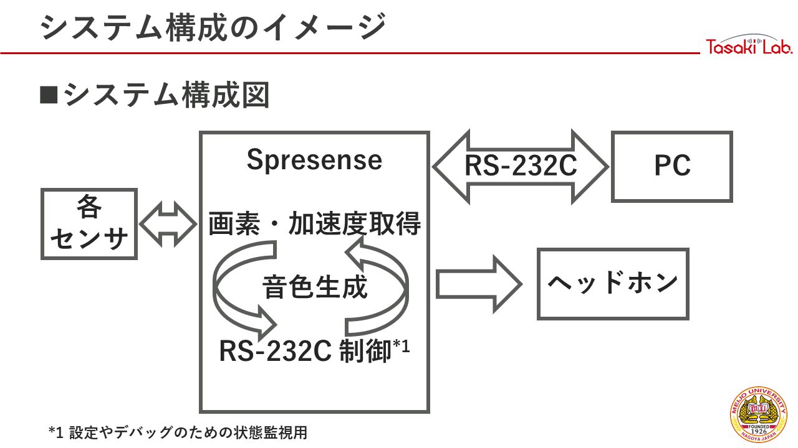
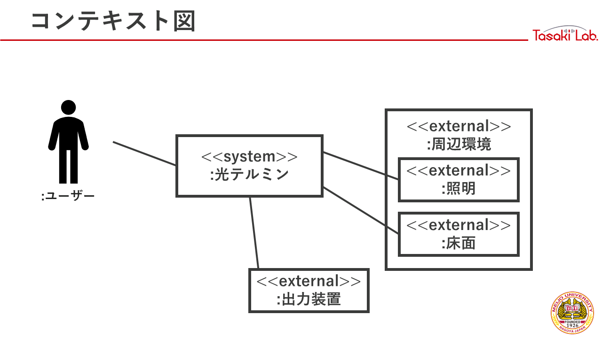
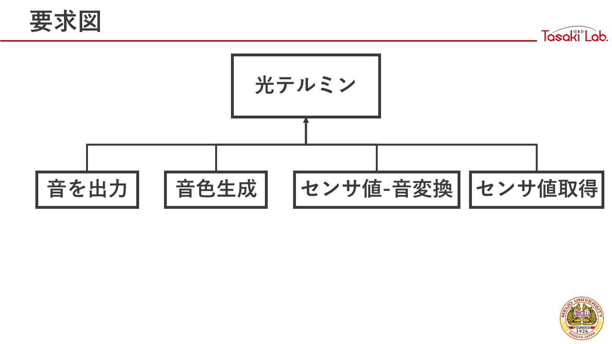
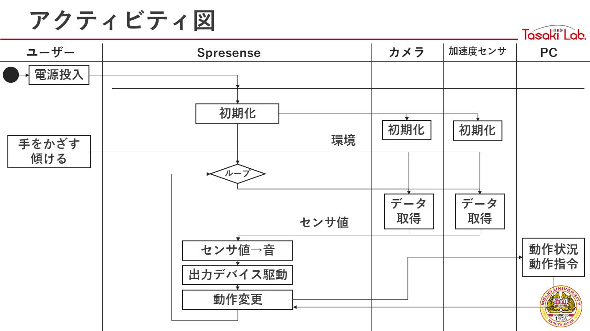
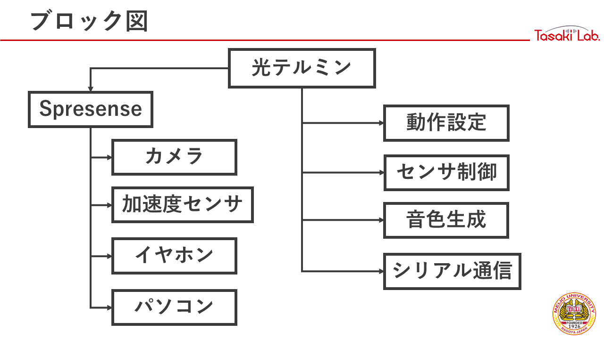
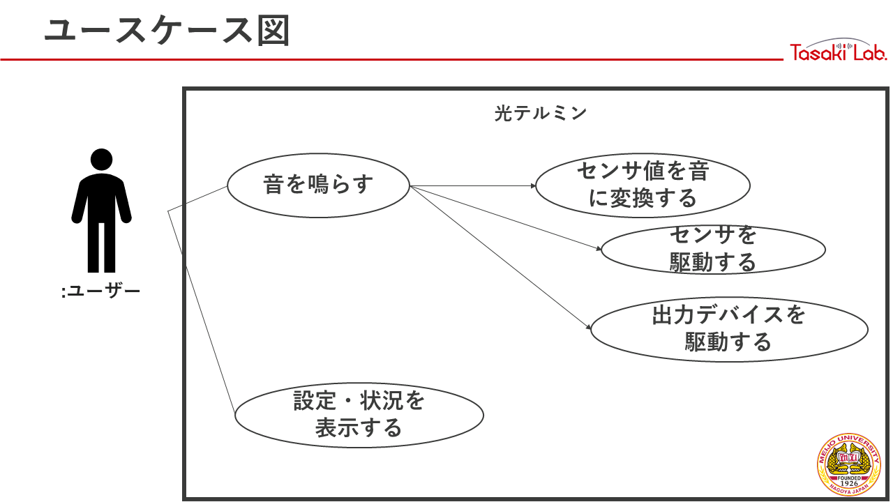
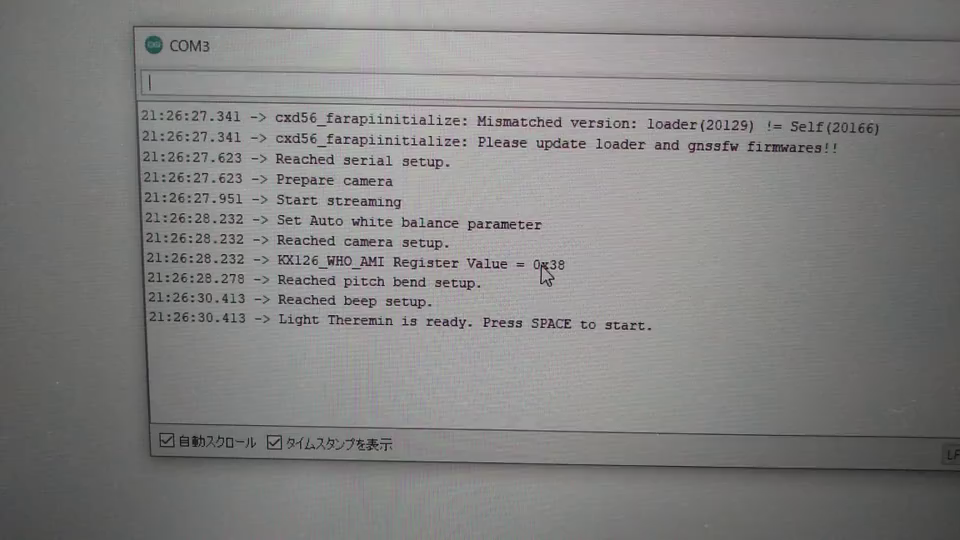
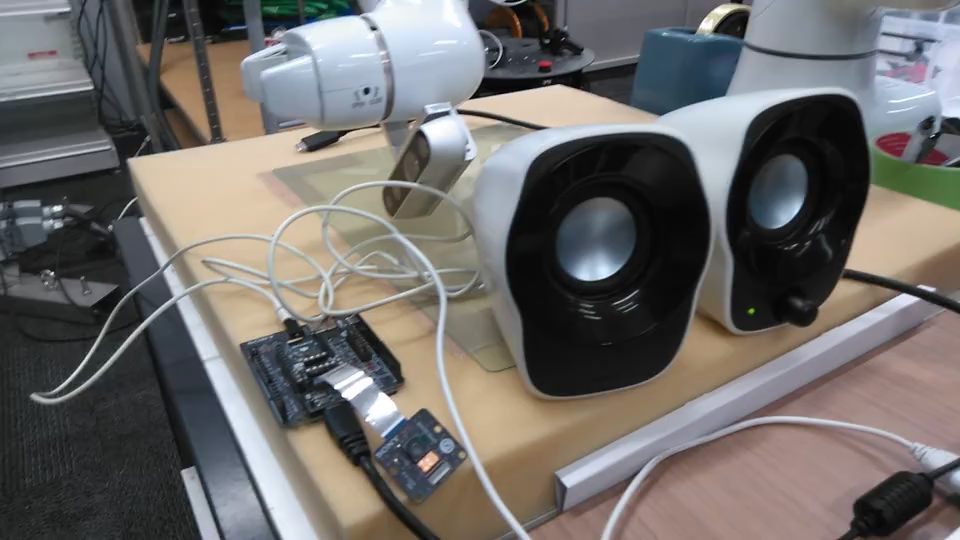
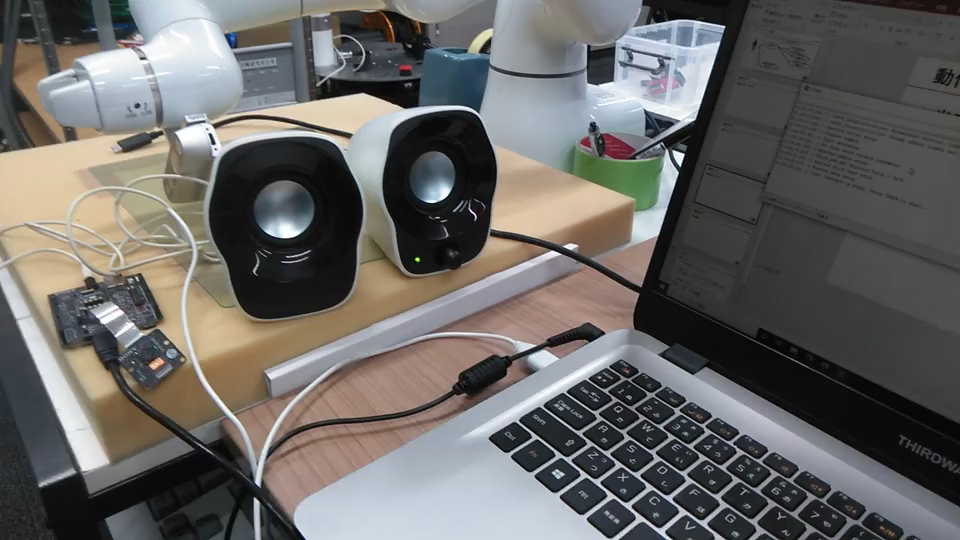
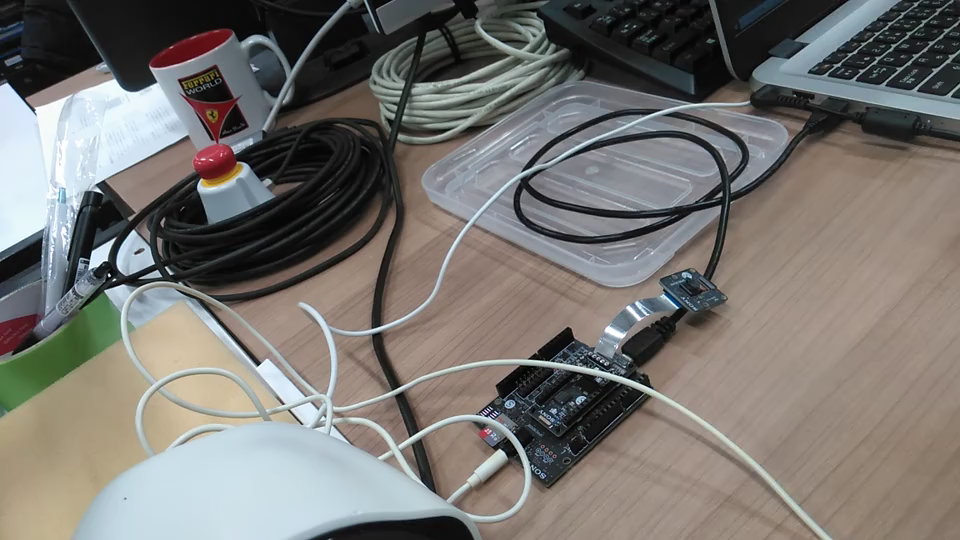

# 光テルミン
## 説明
静電容量ではなく明るさで音程を制御するテルミンです。

## ビルド
1. Spresense の Arduino プロジェクトがビルドできる状態にします。
1. `theremin.ino` を Arduino IDE で開きます。
1. Spresense を PC に接続します。
1. Arduino IDE 上で `Ctrl+U` を押下し、スケッチをマイコンに書き込みます。

## 使い方
1. Spresense を PC に接続します。
1. シリアルモニタを開きます。
1. 準備ができた旨の表示があれば、スペースキーを送信します。
1. カメラ入力が明るくなると高い音、暗くなると低い音がヘッドホン端子に出力されます。なお、ボードを傾けることでも音階を変化させられます。

## 機能
シリアル通信を使用して各種機能にアクセスできます。以下に送信できるキーを示します。
- `v` 半音上げの切り替え
- `s` 状態表示（デバッグ用）
- `p` 短い休符
- `スペース` 出力の切り替え

## システムモデル
### 概要

### コンテキスト図

### 要求図

### アクティビティ図

### ブロック図

### ユースケース図

## 動作デモ
### 音 ON/OFF

### ピッチベンド

### 半音上げる

### 演奏

